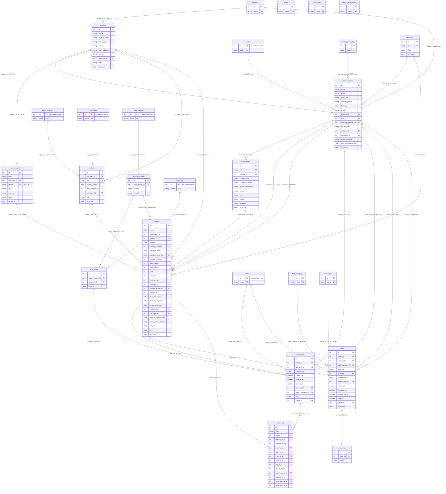

# Схема базы данных (Lift_app)

Источник правды: модели в `src/models/` и миграции Alembic.

## Как смотреть диаграмму

- **GitHub / GitLab**: откройте этот файл в веб-интерфейсе — блок `mermaid` подсветится автоматически.
- **Редактор**: расширение «Markdown Preview Mermaid Support» (или встроенное превью, если есть).
- **Онлайн**: скопируйте блок `mermaid` на [mermaid.live](https://mermaid.live) для экспорта в PNG/SVG.

## Примечания

- Таблица `acts_fact_of_mechanic` в коде отключена, в миграциях отсутствует.
- `steps`, `sub_steps`, `area_of_responsibility` есть в БД, на них нет внешних ключей из других таблиц; шаги в `acts_bases` хранятся строкой `step_list`.
- Тип **String** в SQLAlchemy без длины → обычно VARCHAR/TEXT (зависит от СУБД).

## Ограничения (не FK)

| Таблица | Ограничение |
|---------|-------------|
| `universal_users` | UNIQUE (`email`, `is_actual`) |
| `factories_models` | UNIQUE (`type_object_id`, `factory`, `model`) |
| `acts_bases` | UNIQUE (`factory_model_id`, `type_act_id`) |
| `objects` | UNIQUE (`factory_number`), UNIQUE (`registration_number`), UNIQUE (`factory_number`, `registration_number`) |
| `planned_to` | UNIQUE (`year`, `object_id`) |

---

